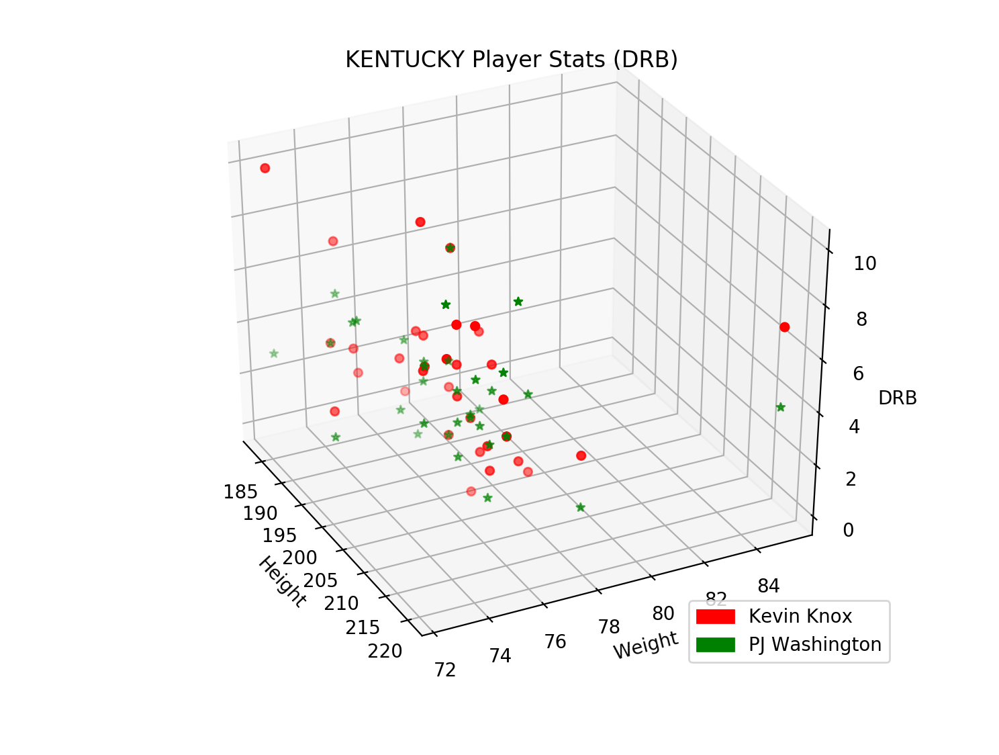
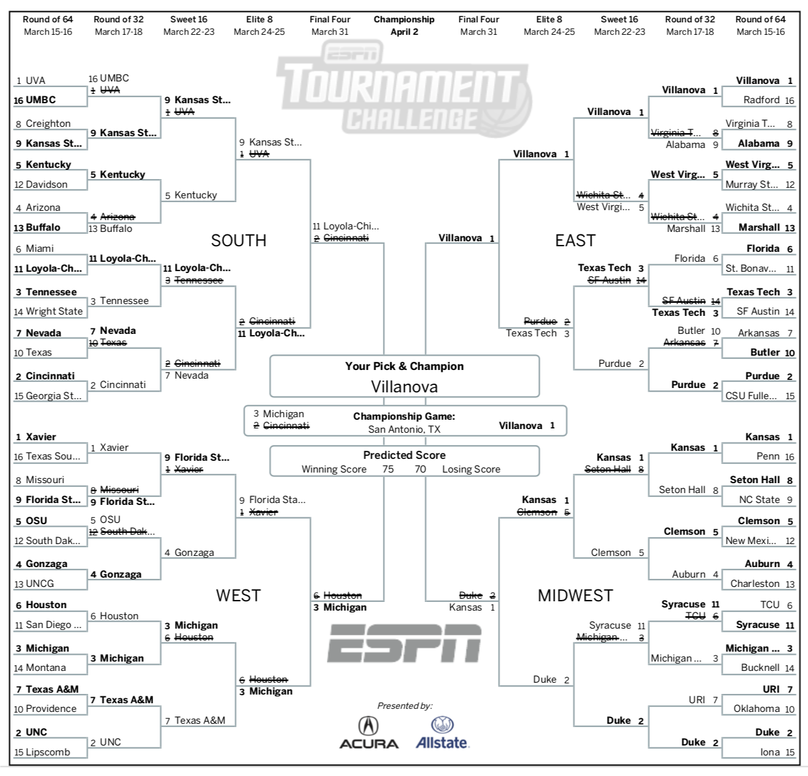

# March Madness Machine (m3)

## Overview

This repo contains the following data, as well as the script to scrape said data:

1. `/rosters`: Rosters for every team in the tournament, as well as rosters for each of their regular season (and conference tournament) opponents.
2. `/schedules`: Schedules for each team in the tournament
3. `/boxscores`: Boxscores from every regular season (and conference tournament) game played by each of the tournament teams
4. `/matchups`: CSVs of the round one matchups for each side of the bracket
5. `/misc-data`: Some additional random miscellaneous data files I found on SR CBB I thought were worth including. May be empty depending on the year.

Note that the top level folders contain only the most recent year's data; look in the `archive` folder for data from previous years.

Note that some rosters are unavailable for lower-tier teams (from schedules, the roster's of all teams in the tournament are available).

This repo also contains some visualization and simulation scripts, explained below. Keep in mind that this is a relatively simple project, and only takes into account performance based on opponent team physiology. It is intended to be built upon over time.

## Setup

To run the crawler, perform the following:

```sh
pip3 install -r requirements.txt  # install the required packages
python3 crawler.py                # run the crawler
```

The crawler will saved failed attempts in a corresponding log file. Certain parts of the pipeline can be skipped by changing the `PIPELINE` variable. For example, if boxscores are not desired, comment out `'boxscores'`.

## Naming Convention

Rosters are named `<team_name>-roster.csv` with `<team_name>` is the name used by [Sports Reference CBB](https://www.sports-reference.com/cbb/)

Schedules are named similarly: `<team_name>-schedule.csv`

Box scores are done a bit differently: `<date_played>-<team_name>-boxscore.csv`, where `<date_played>` is an ISO-like date of the format `YYYY-MM-DD-HH` (the format used in SR CBB's urls).

## Visualization

Visualizations can be generated for any team, and are shown as a 3D scatterplot of a given stat against the physiology (height, weight) of the opposing teams on their schedule. For example the following would generate 2 plots, one for PJ Washington and one for Kevin Knox (both of the Kentucky Wildcats), showing their defensive rebounding totals for each game against the physiology of the opposing team:

```sh
python3 visualize.py kentucky drb "Kevin Knox" "PJ Washington"
```



Available stats are:

-   mp, Minutes Played
-   fg, Field Goals
-   fga, Field Goals Attempted
-   2p, 2 Pointers
-   2pa, 2 Pointers Attempted
-   3p, 3 Pointers
-   3pa, 3 Pointers Attempted
-   ft, Free Throws
-   fta, Free Throws Attempted
-   drb, Defensive Rebounds
-   orb, Offensive Rebounds
-   ast, Assists
-   stl, Steals
-   blk, Blocks
-   tov, Turnovers
-   pf, Personal Fouls
-   pts, Points

## Simulator

Simulate the projected winner of a matchup, based on their previous performances. For example:

```sh
python3 simulate.py kentucky alabama
```

will yield output similar to the following:

> Computing projected winner of KENTUCKY vs ALABAMA...<br />
> 76 - 64, KENTUCKY projected to win

Alternatively, you can also pass in a path to a file containing lines of matchups to run multiple simulations at once:

```sh
python3 simulate.py ../matchups/south-matchups.round1.csv
```

Lines in this file should be formatted as a CSV with the following structure:

| School 1 Name | School 2 Name     |
| :------------ | :---------------- |
| kentucky      | alabama           |
| virginia      | california-irvine |
| ohio-state    | arizona           |

## Results

### 2018

For March Madness 2018, the bot performed surprisingly well given the limited variables considered. The bot placed in the 87th percentile of ESPN's bracket challenge, with the following selections:


